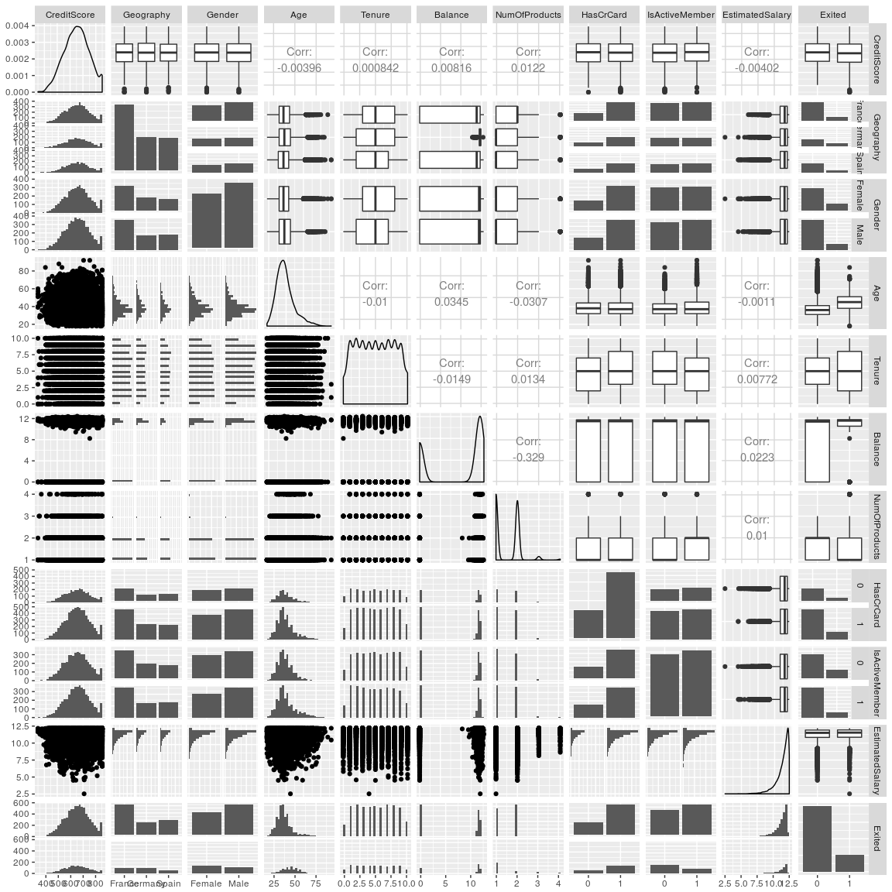

Exploratory Data Analysis
================

``` r
library(tidyverse)
```

    ## Loading tidyverse: ggplot2
    ## Loading tidyverse: tibble
    ## Loading tidyverse: tidyr
    ## Loading tidyverse: readr
    ## Loading tidyverse: purrr
    ## Loading tidyverse: dplyr

    ## Conflicts with tidy packages ----------------------------------------------

    ## filter(): dplyr, stats
    ## lag():    dplyr, stats

``` r
library(broom)
```

``` r
df <- readr::read_csv("data/ABC_Bank_Customers.csv")
```

    ## Parsed with column specification:
    ## cols(
    ##   RowNumber = col_integer(),
    ##   CustomerId = col_integer(),
    ##   Surname = col_character(),
    ##   CreditScore = col_integer(),
    ##   Geography = col_character(),
    ##   Gender = col_character(),
    ##   Age = col_integer(),
    ##   Tenure = col_integer(),
    ##   Balance = col_double(),
    ##   NumOfProducts = col_integer(),
    ##   HasCrCard = col_integer(),
    ##   IsActiveMember = col_integer(),
    ##   EstimatedSalary = col_double(),
    ##   Exited = col_integer()
    ## )

``` r
summary(df)
```

    ##    RowNumber       CustomerId         Surname           CreditScore   
    ##  Min.   :    1   Min.   :15565701   Length:10000       Min.   :350.0  
    ##  1st Qu.: 2501   1st Qu.:15628528   Class :character   1st Qu.:584.0  
    ##  Median : 5000   Median :15690738   Mode  :character   Median :652.0  
    ##  Mean   : 5000   Mean   :15690941                      Mean   :650.5  
    ##  3rd Qu.: 7500   3rd Qu.:15753234                      3rd Qu.:718.0  
    ##  Max.   :10000   Max.   :15815690                      Max.   :850.0  
    ##   Geography            Gender               Age            Tenure      
    ##  Length:10000       Length:10000       Min.   :18.00   Min.   : 0.000  
    ##  Class :character   Class :character   1st Qu.:32.00   1st Qu.: 3.000  
    ##  Mode  :character   Mode  :character   Median :37.00   Median : 5.000  
    ##                                        Mean   :38.92   Mean   : 5.013  
    ##                                        3rd Qu.:44.00   3rd Qu.: 7.000  
    ##                                        Max.   :92.00   Max.   :10.000  
    ##     Balance       NumOfProducts    HasCrCard      IsActiveMember  
    ##  Min.   :     0   Min.   :1.00   Min.   :0.0000   Min.   :0.0000  
    ##  1st Qu.:     0   1st Qu.:1.00   1st Qu.:0.0000   1st Qu.:0.0000  
    ##  Median : 97199   Median :1.00   Median :1.0000   Median :1.0000  
    ##  Mean   : 76486   Mean   :1.53   Mean   :0.7055   Mean   :0.5151  
    ##  3rd Qu.:127644   3rd Qu.:2.00   3rd Qu.:1.0000   3rd Qu.:1.0000  
    ##  Max.   :250898   Max.   :4.00   Max.   :1.0000   Max.   :1.0000  
    ##  EstimatedSalary         Exited      
    ##  Min.   :    11.58   Min.   :0.0000  
    ##  1st Qu.: 51002.11   1st Qu.:0.0000  
    ##  Median :100193.91   Median :0.0000  
    ##  Mean   :100090.24   Mean   :0.2037  
    ##  3rd Qu.:149388.25   3rd Qu.:0.0000  
    ##  Max.   :199992.48   Max.   :1.0000

Notice that only 20% of the people in this dataset exited. If I has more time, I would evaluate the effects of this imbalance in the dataset.

``` r
sapply(df, class)
```

    ##       RowNumber      CustomerId         Surname     CreditScore 
    ##       "integer"       "integer"     "character"       "integer" 
    ##       Geography          Gender             Age          Tenure 
    ##     "character"     "character"       "integer"       "integer" 
    ##         Balance   NumOfProducts       HasCrCard  IsActiveMember 
    ##       "numeric"       "integer"       "integer"       "integer" 
    ## EstimatedSalary          Exited 
    ##       "numeric"       "integer"

There are too many columns here and some, (such as CustomerID) are the wrong data type.

I'm going to start by removing row number, customer id, and surname. It's possible that surname is useful (Perhaps we could uses number of people in family instead?). Now number and customer id may also contain a data leak, but the goal of this analysis is explanation and that won't help us.

In addition, we should consider the Exited, Has Credit Card, Is Active Member as Boolean categorical variables. Gender and Geography should be also factors. Estimated Salary and Balance should be log transformed, as well, since the range of those features are so large. I toyed with the idea of making Tenure and Number of Products ordered variables, but decided that they are both count data, not ranked data. This is a minor distinction but will save me some hassle later on.

``` r
surnameless_df <- df %>% 
  select(-RowNumber, -Surname, -CustomerId) %>%
  mutate_at(c("Gender", "Geography", "Exited", "HasCrCard", "IsActiveMember"), as.factor) %>% 
  mutate_at(c("EstimatedSalary", "Balance"), log1p) # log1p is log(1 + x), which protects us in the case of 0
```

``` r
sapply(surnameless_df, class)
```

    ##     CreditScore       Geography          Gender             Age 
    ##       "integer"        "factor"        "factor"       "integer" 
    ##          Tenure         Balance   NumOfProducts       HasCrCard 
    ##       "integer"       "numeric"       "integer"        "factor" 
    ##  IsActiveMember EstimatedSalary          Exited 
    ##        "factor"       "numeric"        "factor"

GGally is a lovely package for quick EDA. `ggpairs` creates a plot for two

``` r
GGally::ggpairs(data = surnameless_df)
```

    ## `stat_bin()` using `bins = 30`. Pick better value with `binwidth`.
    ## `stat_bin()` using `bins = 30`. Pick better value with `binwidth`.
    ## `stat_bin()` using `bins = 30`. Pick better value with `binwidth`.
    ## `stat_bin()` using `bins = 30`. Pick better value with `binwidth`.
    ## `stat_bin()` using `bins = 30`. Pick better value with `binwidth`.
    ## `stat_bin()` using `bins = 30`. Pick better value with `binwidth`.
    ## `stat_bin()` using `bins = 30`. Pick better value with `binwidth`.
    ## `stat_bin()` using `bins = 30`. Pick better value with `binwidth`.
    ## `stat_bin()` using `bins = 30`. Pick better value with `binwidth`.
    ## `stat_bin()` using `bins = 30`. Pick better value with `binwidth`.
    ## `stat_bin()` using `bins = 30`. Pick better value with `binwidth`.
    ## `stat_bin()` using `bins = 30`. Pick better value with `binwidth`.
    ## `stat_bin()` using `bins = 30`. Pick better value with `binwidth`.
    ## `stat_bin()` using `bins = 30`. Pick better value with `binwidth`.
    ## `stat_bin()` using `bins = 30`. Pick better value with `binwidth`.
    ## `stat_bin()` using `bins = 30`. Pick better value with `binwidth`.
    ## `stat_bin()` using `bins = 30`. Pick better value with `binwidth`.
    ## `stat_bin()` using `bins = 30`. Pick better value with `binwidth`.
    ## `stat_bin()` using `bins = 30`. Pick better value with `binwidth`.
    ## `stat_bin()` using `bins = 30`. Pick better value with `binwidth`.
    ## `stat_bin()` using `bins = 30`. Pick better value with `binwidth`.
    ## `stat_bin()` using `bins = 30`. Pick better value with `binwidth`.
    ## `stat_bin()` using `bins = 30`. Pick better value with `binwidth`.
    ## `stat_bin()` using `bins = 30`. Pick better value with `binwidth`.
    ## `stat_bin()` using `bins = 30`. Pick better value with `binwidth`.
    ## `stat_bin()` using `bins = 30`. Pick better value with `binwidth`.
    ## `stat_bin()` using `bins = 30`. Pick better value with `binwidth`.
    ## `stat_bin()` using `bins = 30`. Pick better value with `binwidth`.
    ## `stat_bin()` using `bins = 30`. Pick better value with `binwidth`.
    ## `stat_bin()` using `bins = 30`. Pick better value with `binwidth`.



Just looking at this facet grid, there a few things I see. Take a look at the rightmost column. These are interactions between "Exited" and the other columns. Credit Score, Geography, Gender, Number of Products, Salary, and Salary all seem to have similar distributions between those who have and have not exited. Age and Balance seem to have different distributations. This would suggest that they could be good features.

``` r
set.seed(22)
test_df <- sample_frac(surnameless_df, 0.2)
train_df <- anti_join(surnameless_df, test_df) # Remove anything included in test_df
```

    ## Joining, by = c("CreditScore", "Geography", "Gender", "Age", "Tenure", "Balance", "NumOfProducts", "HasCrCard", "IsActiveMember", "EstimatedSalary", "Exited")

Before I make any more powerful predictive models, I am going to create a basic logistic regression model on all of the data.

``` r
exploratory_log_model <- glm(Exited ~ ., data=train_df, family = binomial) # Binomial family for logistic regression
```

``` r
(log_model_results <- broom::tidy(exploratory_log_model) %>% 
   arrange(p.value))
```

    ##                term      estimate    std.error   statistic       p.value
    ## 1               Age  0.0716354739 0.0028707872  24.9532508 1.968751e-137
    ## 2   IsActiveMember1 -1.0788463922 0.0645820941 -16.7050389  1.204495e-62
    ## 3  GeographyGermany  0.7245864056 0.0774600664   9.3543220  8.413757e-21
    ## 4       (Intercept) -4.0066709113 0.4448993818  -9.0057911  2.141164e-19
    ## 5        GenderMale -0.5097243303 0.0608699478  -8.3739899  5.569952e-17
    ## 6           Balance  0.0281686458 0.0067561190   4.1693531  3.054654e-05
    ## 7            Tenure -0.0204488860 0.0104715435  -1.9528053  5.084267e-02
    ## 8       CreditScore -0.0004822985 0.0003127497  -1.5421228  1.230437e-01
    ## 9   EstimatedSalary  0.0483086931 0.0314042991   1.5382828  1.239795e-01
    ## 10    NumOfProducts -0.0801742444 0.0527884565  -1.5187836  1.288170e-01
    ## 11   GeographySpain  0.0508988884 0.0785955467   0.6476052  5.172403e-01
    ## 12       HasCrCard1 -0.0106980890 0.0667015433  -0.1603874  8.725759e-01

Let's take a look at the "insignificant" (p &gt; 0.05) results.

``` r
 log_model_results %>% 
  mutate(significant = ifelse(p.value < 0.05, TRUE, FALSE)) %>% 
  filter(significant == FALSE)
```

    ##              term      estimate    std.error  statistic    p.value
    ## 1          Tenure -0.0204488860 0.0104715435 -1.9528053 0.05084267
    ## 2     CreditScore -0.0004822985 0.0003127497 -1.5421228 0.12304375
    ## 3 EstimatedSalary  0.0483086931 0.0314042991  1.5382828 0.12397948
    ## 4   NumOfProducts -0.0801742444 0.0527884565 -1.5187836 0.12881696
    ## 5  GeographySpain  0.0508988884 0.0785955467  0.6476052 0.51724030
    ## 6      HasCrCard1 -0.0106980890 0.0667015433 -0.1603874 0.87257589
    ##   significant
    ## 1       FALSE
    ## 2       FALSE
    ## 3       FALSE
    ## 4       FALSE
    ## 5       FALSE
    ## 6       FALSE

Since the treatment of France to Germany was considered significant, we can still include geography. Tenure, number of products, salary and credit score do not seem to have an effect. Note that linear models are only capable of detecting linear relationships. I will add evidence about this claim in the Jupyter Notebook.

Now we should evaluate how well the model predicted with logloss and accuracy.

``` r
test_y <- select(test_df, Exited) %>% 
  mutate(Exited = ifelse(Exited == "0", 0, 1)) # Converting factor back to bool
test_x <- select(test_df, -Exited)
```

``` r
test_predict_proba <- predict.glm(exploratory_log_model, newdata = test_x, type = "response")
Metrics::logLoss(test_y %>% pull(Exited), test_predict_proba)
```

    ## [1] 0.4263014

This is actually a rather good log loss!

Here's the accuracy of the model:

``` r
test_predict <- round(test_predict_proba)
1 - Metrics::ce(test_y %>% pull(Exited), test_predict)
```

    ## [1] 0.818

I will export this data to python run more tests on the data. Here, I'll do a neat trick to get are to do all the one hot encoding for me. I concatenate the Exited column to the model matrix of glm that contains all the data. Then I export it as a feather, a pandas/R interoperable format.

``` r
y_df <- surnameless_df %>% 
  select(Exited)

export_model <- glm(Exited ~ ., data=surnameless_df, family = binomial)

export_df <- as_tibble(model.matrix(export_model)) %>% 
  bind_cols(y_df) %>% 
  select(-`(Intercept)`)
                       
feather::write_feather(export_df, "results/cleaned_df.feather") # Feather is a fast, interoperable file format for
```

``` r
sessionInfo()
```

    ## R version 3.3.3 (2017-03-06)
    ## Platform: x86_64-pc-linux-gnu (64-bit)
    ## Running under: Ubuntu 16.04.3 LTS
    ## 
    ## locale:
    ##  [1] LC_CTYPE=en_CA.UTF-8       LC_NUMERIC=C              
    ##  [3] LC_TIME=en_CA.UTF-8        LC_COLLATE=en_CA.UTF-8    
    ##  [5] LC_MONETARY=en_CA.UTF-8    LC_MESSAGES=en_CA.UTF-8   
    ##  [7] LC_PAPER=en_CA.UTF-8       LC_NAME=C                 
    ##  [9] LC_ADDRESS=C               LC_TELEPHONE=C            
    ## [11] LC_MEASUREMENT=en_CA.UTF-8 LC_IDENTIFICATION=C       
    ## 
    ## attached base packages:
    ## [1] stats     graphics  grDevices utils     datasets  methods   base     
    ## 
    ## other attached packages:
    ## [1] bindrcpp_0.1    broom_0.4.2     dplyr_0.7.0     purrr_0.2.2.2  
    ## [5] readr_1.1.0     tidyr_0.6.3     tibble_1.3.3    ggplot2_2.2.1  
    ## [9] tidyverse_1.1.1
    ## 
    ## loaded via a namespace (and not attached):
    ##  [1] Rcpp_0.12.11       RColorBrewer_1.1-2 bindr_0.1         
    ##  [4] plyr_1.8.4         forcats_0.2.0      tools_3.3.3       
    ##  [7] digest_0.6.12      lubridate_1.6.0    jsonlite_1.5      
    ## [10] evaluate_0.10      nlme_3.1-131       gtable_0.2.0      
    ## [13] lattice_0.20-34    pkgconfig_2.0.1    rlang_0.1.1       
    ## [16] psych_1.7.3.21     GGally_1.3.0       yaml_2.1.14       
    ## [19] parallel_3.3.3     haven_1.0.0        xml2_1.1.1        
    ## [22] stringr_1.2.0      httr_1.2.1         knitr_1.16        
    ## [25] Metrics_0.1.2      hms_0.3            rprojroot_1.2     
    ## [28] grid_3.3.3         reshape_0.8.6      glue_1.0.0        
    ## [31] R6_2.2.1           readxl_0.1.1       foreign_0.8-67    
    ## [34] rmarkdown_1.4      feather_0.3.1      modelr_0.1.0      
    ## [37] reshape2_1.4.2     magrittr_1.5       backports_1.0.5   
    ## [40] scales_0.4.1       htmltools_0.3.6    rvest_0.3.2       
    ## [43] assertthat_0.2.0   mnormt_1.5-5       colorspace_1.3-2  
    ## [46] labeling_0.3       stringi_1.1.5      lazyeval_0.2.0    
    ## [49] munsell_0.4.3
